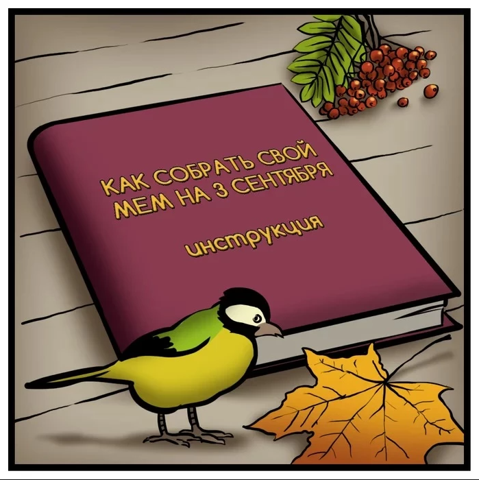
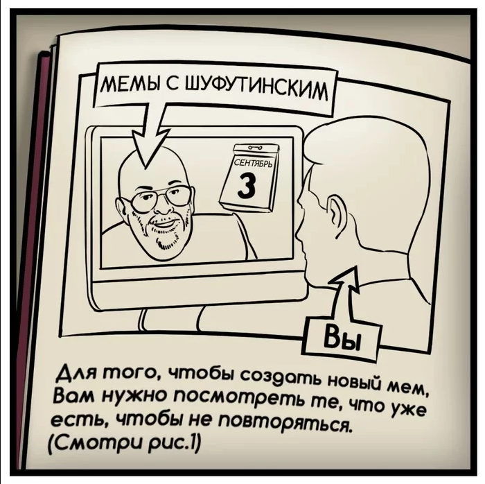
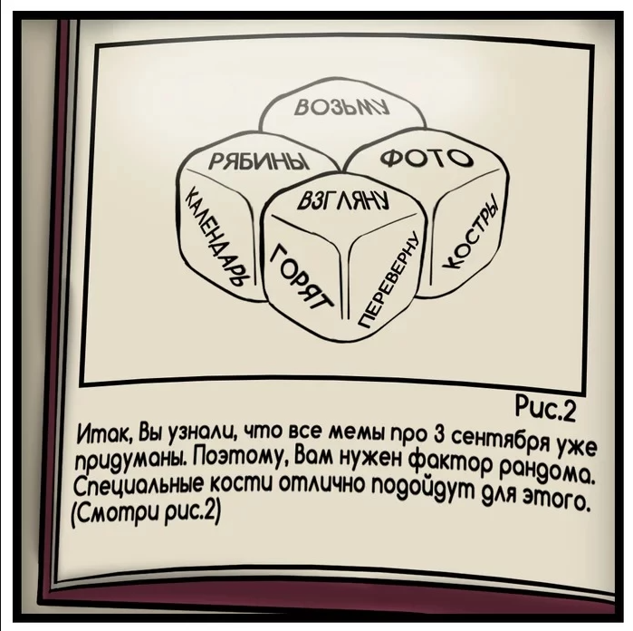
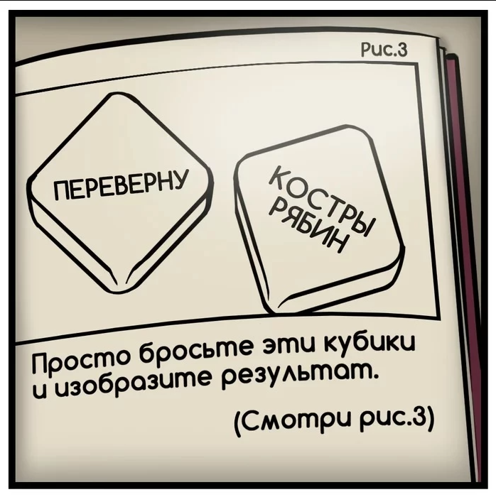
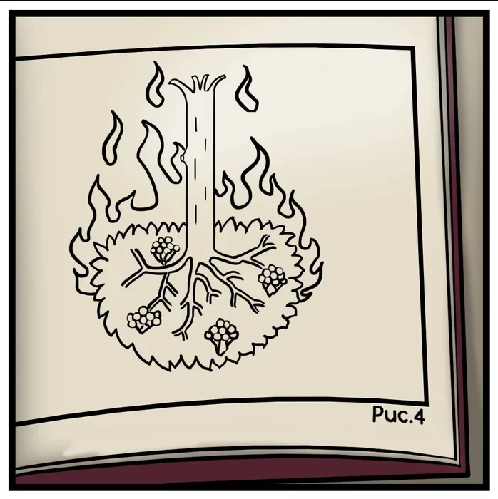
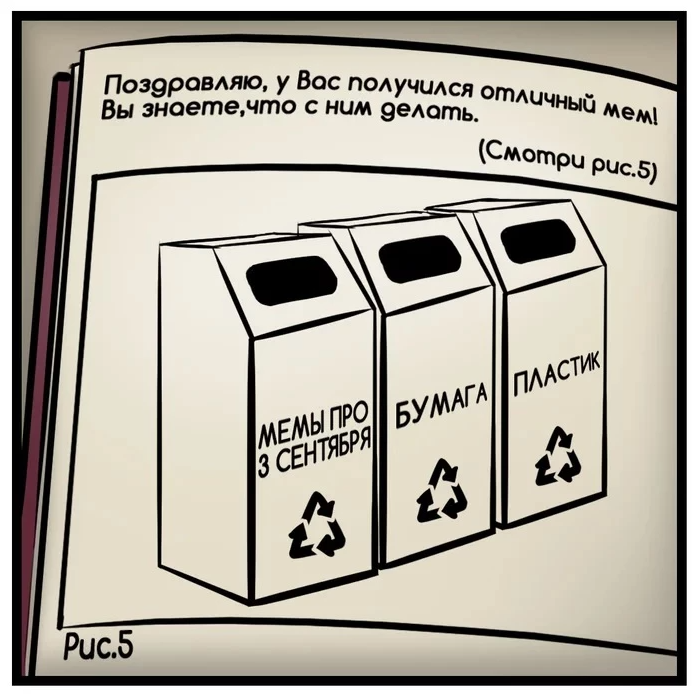

## Пошуфутим?)

Пошаговая инструкия как создать свой мини мемасик.

Как говорится, готовь сани летом, а мемасы к 3 сентября, зимой. Погнали! 

1. Подготовить место создателя:

- вкусный чай/ кофе/ винишко
- соответствующая музыка
- настроение пошуфутить

2. Если ты молод, можно погуглить кто такой Михаил Шуфутинский.

3. Все дело в костях...

4. Испытай удачу и нарисуй то, что выпадет

5. Рисуем!

> Настоящий художник никогда не видит мир таким, какой он есть, иначе это был бы не художник

6. Finita La Commedia

